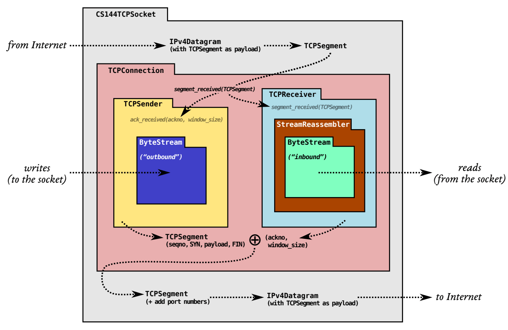
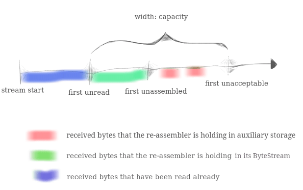

# lab2

由于期末考试这个 lab 前后相隔半个月，但总共写的时间却不多，满打满算大概两天吧，整体逻辑不难，就是几个 tricky 的概念一开始想不出来，需要对着样例 debug 才行。这是 cs144 的第一篇 blog，至于前两篇等 lab4 做出来之后再来补，我知道自己的代码中还有 bug，就不贴代码了。

**TCP receiver**

* lab0 实现一个 flow-controlled byte stream（字节流），lab1 实现一个 StreamReassembler（流重组器）。lab2 主要对二者进行包装，实现一个 TCPReceiver，足够我们能够接收 **TCP segments**（the payloads of datagrams carried over the Internet）。&#x20;

* 另外，我们还要输出两个数值，**ackno** 和 **window size** 。
  * **ackno** 是第一个未重组的 **absolute seqno** 下标转化为 32 位后的下标，**ackno** 就是来预测 **segment** 的。32位下，它期望下个 **segment seqno**，注意它包含 _syn_ 和 _fin_。
  * **window size** 是其实对于下层的概念，第一个未重组的位到第一个未接受的位的距离。此处未重组不是 **ackno**，**ackno** 是对上层的概念。

**Translating between 64-bit indexes and 32-bit seqnos**

* 这个 64-bit 到 32-bit 的包装相当于一个热身。

\(\)IC0PG}0.png)

* 此处 **checkpoint** 是一个 _tricky_ 点，它是为了分辨 **absolut seqno** 是那个 $$2^{32}$$ 的级别。需要找到那个离 **checkpoint** 最近的级别。$$\lfloor checkpoint \rfloor + seqno$$ 分别加减 $$2^{32}$$，这三者比较距离即可。

**Implementing the TCP receiver**

* 向重组器 push 的思路不难，计算 seqno，push 即可。不过 syn 且 data.size=0 不要 push，syn 且 data.size > 0 那么要用 ab-seqno。
* 窗口也不难，read + cap - reassembler.ex 即可。

* 重点在 ackno 的计算上，未 push 之前保存一下 `reassembler.expect_index()`，push 之后再保存新的 expect\_index，二者做差，是正常情况下由于 push 我们重组了多少位，ackno 加上这个差值。当 syn 时，自动加一。当 fin 时就麻烦了，我们不知道它究竟还有多少没重组。我的策略是计算出 fin 的预测的 ab\_seqno，`ackno == stfin` 时再加上 fin 的那一位，因为 ackno 是 segment 期待的下一位，当他期待 fin 时，说明所有的都重组完毕了。

#### 总结

* lab2 不难，和 lab1 一样有几个 tricky 点，自我感觉自己的实现有点屎山了，等 lab4 在大优化一下。
